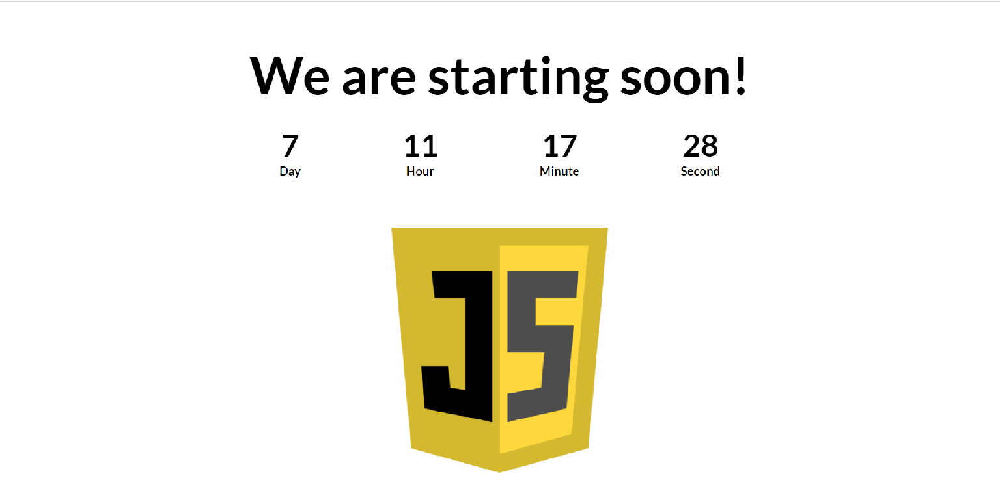

# Countdown App

Simple JavaScript project. App counts down time to an important event.

## Screenshots

<!-- 

 -->

## Technologies
* HTML5/CSS3
* JavaScript(ES6)

## Setup
link to netlify

## Status
Project is: _completed_

## Inspiration
App project is inspired by the tutorial "Simple JavaScript Countdown Tutorial" from Dev Ed.